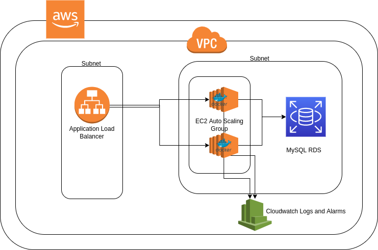

# Solution 

## Overview

1. API implemented using spring boot has been used for this challenge solution. https://github.com/gothinkster/spring-boot-realworld-example-app
2. AWS is used as the cloud provider.
3. Entire infra has been provisioned using `terraform`.
4. Github actions has been used to automate build, test and deployment(CI/CD).
5. RDS has been used to run MySQL and configured to be backed up daily in configured window.
6. EC2 Autoscaling with docker has been used to run the app with ALB.
7. Cloudwatch has been used as central place to view the logs.
8. Cloudwatch has been used to autoscale based on CPU and all metrics for EC@ instances part of autp scaling group can be viewed in cloudwatch.

## Architecture



## To Create Infra

```bash
$ cd terraform
# create s3 bucket and dynamo db table for remote backend and locking
$ cd Webserver-Cluster/global/s3
$ terraform init
$ terraform apply --auto-approve
# create mysql rds
$ cd ../../live/prod/data-stores/mysql
$ terraform init
$ terraform apply --auto-approve
# create EC2 autoscaling group, ALB, cloudwatch
$ cd ../../live/prod/services/hello-world-app
$ terraform init
$ terraform apply --auto-approve
```

## To test

```bash
# Get alb dns url 
$ cd terraform/live/prod/services/hello-world-app
$ terraform output alb_dns_name
$ curl <alb_dns_url>/health
```
